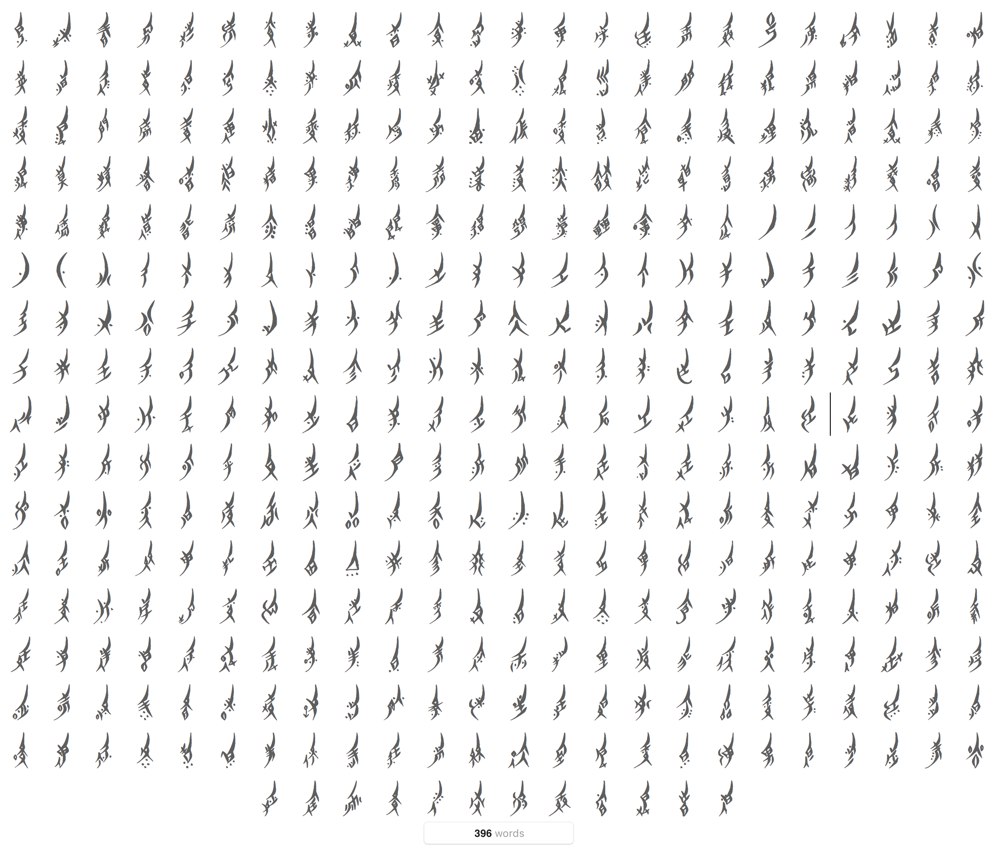
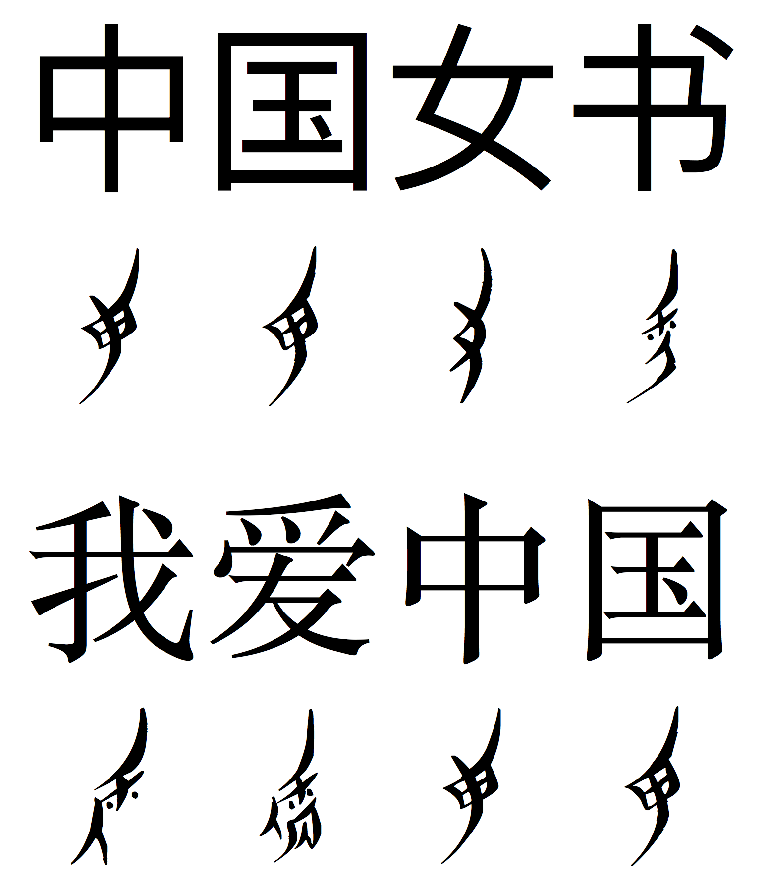
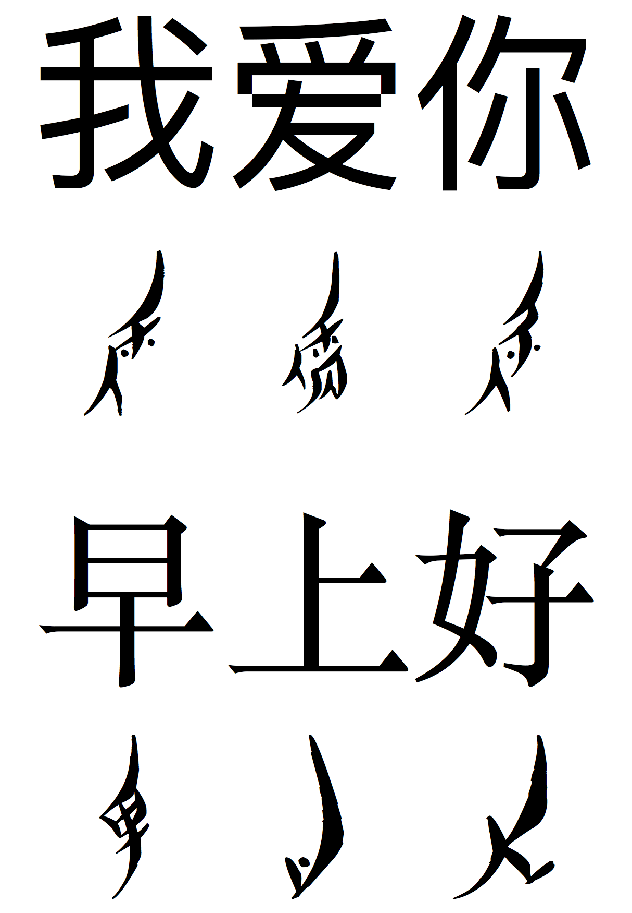

# Women Scripts

https://github.com/SihongHo/WomenScripts

## 什么是女书？What are Women’s Scripts?

> Nüshu (simplified Chinese: 女书; traditional Chinese: 女書; pinyin: Nǚshū [nỳʂú]; lit. 'women's script') is a syllabic script derived from Chinese characters that were used exclusively among women in Jiangyong County in Hunan province of southern China. Nüshu has been included in the Unicode Standard since June 2017.
女书，又名江永女書，是一种独特的汉语书写系统。它是一種專門由女性使用的文字，起源於中國湖南省南部永州的江永县。其一般被用来书写属于湘语永全片的江永城关方言。以前在江永县及其毗邻的道县、江华瑶族自治县的大瑶山、以及广西部分地区的妇女之间流行、传承。由于女书在文化大革命期间被嚴重破壞，再加上随着时代的发展及人口外流，现在女书正濒临灭绝。
> 

For more details, please refer to Wikipedia (**[Nüshu](https://en.wikipedia.org/wiki/Nüshu), [女书](https://zh.wikipedia.org/wiki/女书)**). And you can also go to this website to learn more about women’s scripts: [http://www.thurcacca.org/booksearch.html](http://www.thurcacca.org/booksearch.html)

## 此库提供了什么？What do I provide in this GitHub repo?

I provide the willow font package of women's scripts. The willow font is from the book “Standard Characters Calligraphy Script for Women’s Scripts”, published by Yan Xu and Liming Zhao. I have got the permission of the author to make their font as a font package used on computers.

在此repo中，我提供了女书柳叶体字体包。柳叶体来源于徐焰，赵丽明老师编写的《女书规范字书法字帖》一书。在取得作者之一徐焰老师同意后，我制作了可在电脑中使用的柳叶体字体包。

## 如何使用提供的字体包？How to use the provided font package?

Since the women’s scripts are epigraphic scripts, they have a many-to-many relationship with Chinese characters. That is: a Chinese character may correspond to more than one women’s script, and a women’s script may also express the meaning of more than one Chinese character at the same time. This font package contains 396 women’s scripts, each women’s script corresponds to one Chinese character.

由于女书是一种表音文字，女书与汉字呈现多对多的关系：即一个汉字可能与多个女书对应，一个女书也可以同时表达多个汉字意思。本字体包共包含396个女书字，每一个女书字均对应一个汉字。

我所选取的396个汉字分别是：“尾带春别梯吉妇塔河著雪朋刻东辛焦愁省号牛欧酒叔咬英同欢黄想广重鸳响梅岁轻悲恨灾解君存把思啼移祖初孤德毛高透其食浪墨房断垫候风前善盈浸埋脱借胜娇鸟倚莫堵路湖道节黑神绣错多远淡饮挖慈意独乐争美唱惊贵爱谢卖杯歌暑沉妻眼给福谷凤渐费毑几一二七人八十漂屋水了义大尺下朝小土女文工寸顾九两上千三没知非屈太才发子弟世夫火父主句婚好斗六交手劝方忘算看年天井王味吹出内对金称夜银音吃不压他会之时士己叶绿尿少母又去月如本日怜口正投柳后作左生反行眉光亮汤讲娘先边听平见笔立起老拜明来在采乖快忧白百写气住和古哭无背华葛开门色吞心新讨到阁休所落炭万国外全映望庄双中孔用田念病命成圣言五早四归鬼热申派怀辣菜衣花自切妾西合猜我书处配魂尽楼包茅做臭肉有喊耕难常半郎你松长将阳请声宁显牵里谁排奈胎家假嫁云比哑孙铁齐祭计赵跳步腹茶过珠玉娶北舍品慢等信红草冒各就秋羞觉鱼寿通奉枉当聪砍空良香点连男胆冷定清星经卷展贤燕安为坐雷退昔引”

### 如何安装 How to install?

Download the font package (nvshu1.tff) and install it according to different computer systems. Just like installing a regular font package.

下载字体包(nvshu1.tff)后根据不同电脑系统安装即可。一般来说 Windows XP 以上均可一键安装。XP系统需要将字体包复制到字体库。

### 其他文件 Other docs

压缩文件pictures with index：该压缩包包含396个图片，分别是396个女书字，其命名为《女书规范字书法字帖》中的序号。命名规则为第i数-第j个字。

xlsx文件character table and index：该表格包含《女书规范字书法字帖》中396个女书能对应的所有汉字，以及开发者根据出现频率挑选出来的396个对应汉字。

docx文件nvshu1.0FontTable女书1.0字表：该文本包含396个对应汉字，用户可通过改变字体选择显现为汉字或柳叶体女书字。

## 其他 Others

This font package is produced in 2018. And I do not have any plan to update it.

我在2018年创建了这个字体包，且没有计划对它进行进一步升级。

## 展示 Showcase

(Chinese Women's Scripts; I love China )

(I love you; Good morning)
